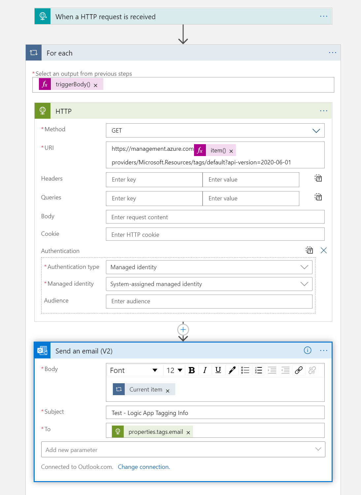

# AzureMonitor-DevOps

Sample Azure Monitoring Environment For SQL at Scale Using Azure DevOps and Azure Policy 

## Overview Of Architecture

## Replicating the Architecture 

1. Create Management Groups hiearchy to mirror above architecture

2. Create Log Analytics Workspace in Resource Group dedicated to monitoring

3. Set Azure Policy to enforce collection of diagnostic logs (in this case for SQL resources) at Management group level

4. Leverage Azure DevOps for Alerts, Policy (optional), and Workbooks (optional) or other visualizations) as code

5. Create Action Group(s) in Resource Group dedicated to monitoring either using ARM templates or Manually

## Routing Alerts by Tags in a Logic App
A Logic App can be built to respond to alerts from a central Log Analytics workspace. One approach is to leverage tags to determine alert routing. [Managed Identity can be enabled in Logic Apps](https://docs.microsoft.com/en-us/azure/logic-apps/create-managed-service-identity) to support triggers and actions like Graph API calls to fetch tag information. Please note that a system-assigned role as management group reader would be necessary to provide tag visiblity across a central workspace. 

In the example above, tags are encoded with email metadata. The Logic App will parse this information and then send an Outlook email to a designated address contained within the tag. Outlook is one of many [Logic Apps connectors](https://docs.microsoft.com/en-us/connectors/connector-reference/connector-reference-logicapps-connectors) that can be configured to simplify actions and triggers. Additional and/or alternative connectors could be put into place to support steering alerts to the right place.

## License

MIT License

Copyright (c) 2021 Jacob Garcia

Permission is hereby granted, free of charge, to any person obtaining a copy
of this software and associated documentation files (the "Software"), to deal
in the Software without restriction, including without limitation the rights
to use, copy, modify, merge, publish, distribute, sublicense, and/or sell
copies of the Software, and to permit persons to whom the Software is
furnished to do so, subject to the following conditions:

The above copyright notice and this permission notice shall be included in all
copies or substantial portions of the Software.

THE SOFTWARE IS PROVIDED "AS IS", WITHOUT WARRANTY OF ANY KIND, EXPRESS OR
IMPLIED, INCLUDING BUT NOT LIMITED TO THE WARRANTIES OF MERCHANTABILITY,
FITNESS FOR A PARTICULAR PURPOSE AND NONINFRINGEMENT. IN NO EVENT SHALL THE
AUTHORS OR COPYRIGHT HOLDERS BE LIABLE FOR ANY CLAIM, DAMAGES OR OTHER
LIABILITY, WHETHER IN AN ACTION OF CONTRACT, TORT OR OTHERWISE, ARISING FROM,
OUT OF OR IN CONNECTION WITH THE SOFTWARE OR THE USE OR OTHER DEALINGS IN THE
SOFTWARE.
© 2021 GitHub, Inc.
